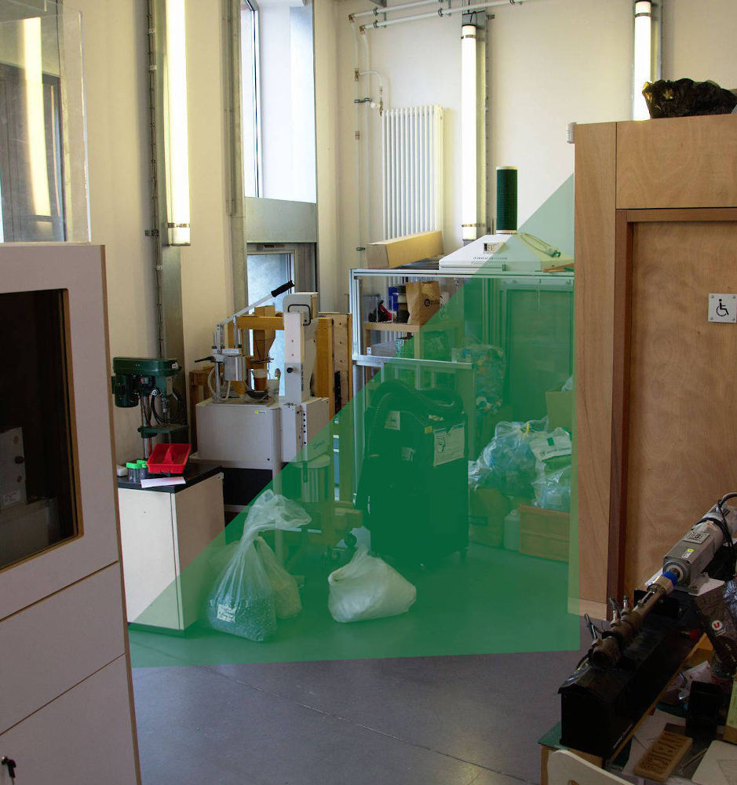
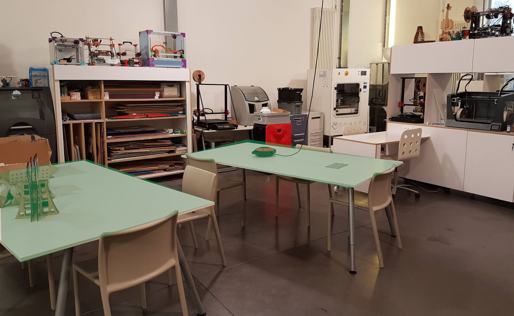

```{r setup, include=FALSE}
knitr::opts_chunk$set(echo = FALSE)
#library(rmarkdown)
#render("Challengues-1.Rmd", output_format = "pdf_document")


```


\thispagestyle{fancy}

## Objectifs 

> Ce travail est une mise en pratique des différentes compétences autour du métier d'animateur de tiers-lieu eco-responsable.
Dans les parcours, vous avez eu des éléments sur la conception, une sensibilisation sur l'analyse des besoins et enfin vu le design thinking comme outil pour la création de nouveaux produits/solutions.
De plus, vous avez été sensibilisé aux notions de fabrication et recyclage distribué.


## Contexte du travail

Dans la stratégie du Lorraine Fab Living Lab (comme pour tous les tiers- lieux), l'optimisation de l'espace de travail est un facteur très important à considérer.
Nous pouvons définir ici deux problématiques:


1. Un espace *atelier mécanique* va s'implanter dans les locaux pour assurer un parc de machines afin de répondre aux besoins de création de prototypes usines.
2. Au vu de cette transformation, les tables de travail devront être reconfigurées et imaginées autrement. 

```{r, layout="l-body", out.width="90%", fig.align = "center", fig.cap=' Challenge 1'}

```


```{r, layout="l-page",  out.width="90%", fig.align = "center", fig.cap=' Challenge 2'}


```

En tant qu'animateur de tiers-lieu eco-responsable, vous êtes en charge de trouver une option d'ameublement qui soit cohérente avec l'usage des lieux.  

**Vu que c'est un espace un peu particulier, il n'y a pas de mobilier sur le marché qui réponde aux besoins, ni pour l'atelier ni pour les tables**. 


L'espace présente également certaines contraintes:

- La proposition doit garantir l'accessibilité aux outils et matériaux de façon érgonomique pour l'atelier et pour la personne qui s'installe aux tables pour travailler.
- Avoir une espace propre et facile à nettoyer s'avère être un élément important.
- Il n'est pas possible de percer les murs. 
- Pouvoir mobiliser et ajuster la configuration de l'espace facilement est aussi un élément essentiel.


## Challenge

1. Il s'agira de former deux groupes, chaque groupe traitera un sujet différent.

2. Vous devez faire une proposition globale d'ammeublement qui prend en compte ces trois aspects complémentaires: *1) la faisabilité, 2) la durabilité et 3) l'attractivité*

Pour cela, dans le dépôt de Github vous trouverez quelques éléments de démarrage du projet:

- Plan Skech-up du LF2L.
- Plan.


## Démarche

Pour résoudre ce problème, vous allez développer une démarche en trois phases bien distinctes:

1. **Prototype pour l'attractivité (PA)**: Cette phase correspond à la création des prototypes qui ont comme objectif la validation d'un concept solution à partir d'une analyse de besoins.

PA se focalise sur la satisfaction et la valeur perçue par l'utilisateur final, donc cette phase encourage l'animateur du tiers-lieux à explorer une grande quantité d'options avec l'utilisateur final. 

Quelques questions pour enrichir et diriger la réflexion: 

- Qui sont les utilisateurs et les parties prenantes de cet espace ? 

- Quels sont les besoins des parties prenantes ?


2. **Protypage pour Faisabilité & Durabilité (PFD)**: Cette phase correspondant à la convergence et à la validation technique globale d'une solution en considérant des sous-systèmes choisis.


Quelques questions pour orienter la réflexion: 

- Dans une optique de conception DIY, quels sont les éléments qui peuvent être fabriqués avec les moyens techniques disponibles au LF2L?
  - Quels sont les éléments qui peuvent être issus de l'impression 3D recyclé ?

- Peut-on avoir une liste de composants ?


3. **Prototypage pour la Viabilité** (PV): Cette phase correspond à la validation detaillée de l'espace et des objets qui en feront partie.

Quelques questions pour orienter la réflexion: 

- Combien d'objets feront partie de cet espace?
- Rapport entre les objets achetés/fabriqués?


## Rendu Final

Vous devez faire une proposition où il faut retrouver:

1. L'analyse de besoins des utilisateurs pour chaque problématique. 

2. Un canevas pour chaque étape de prototypage (PA, PFD, PV) (au moins 1)

    - Au moins un canevas prototype visuel (Dessin, Maquette, Image VR) pour chaque étape avec son canevas respectif.

3. L'identification des objets qui peuvent être issus d'une fabrication par des acteurs locaux. 

5. La liste et l'identification des objets qui peuvent être issus d'une fabrication locale in-situ avec les moyens du LF2L. 


## Références à consulter

- Menold, J., Jablokow, K., Simpson, T., 2017. Prototype for X (PFX): A holistic framework for structuring prototyping methods to support engineering design. Des. Stud. 50, 70–112. https://doi.org/10.1016/j.destud.2017.03.001

- Lauff, C., Menold, J.;, Wood, K.L., 2019. Prototyping Canvas: Design Tool for Planning Purposeful Prototypes 5–8. https://doi.org/10.1017/dsi.2019.162

- [Prototyping canva](https://www.dimodules.com/prototypingcanvas)

- Camburn, B., Viswanathan, V., Linsey, J., Anderson, D., Jensen, D., Crawford, R., Otto, K., Wood, K., 2017. Design prototyping methods: State of the art in strategies, techniques, and guidelines. Des. Sci. 3. https://doi.org/10.1017/dsj.2017.10


